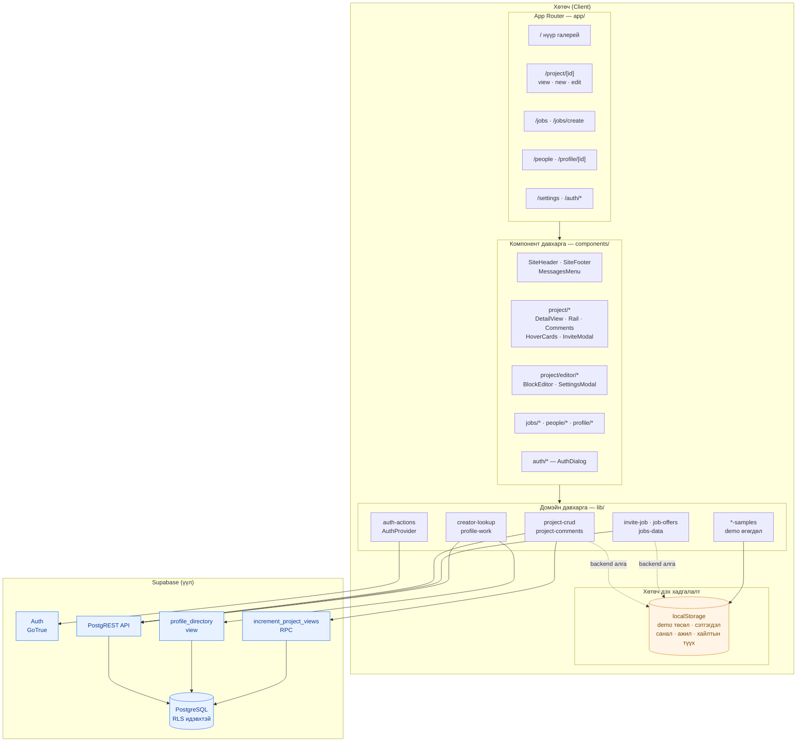
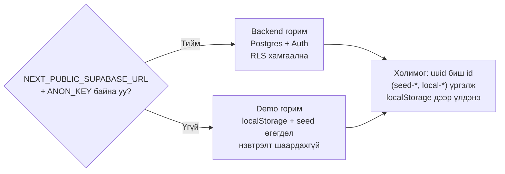

# 1. System Architecture Diagram

Системийн ерөнхий бүтэц — давхаргууд ба тэдгээрийн хоорондын өгөгдлийн урсгал.

**Гол зарчим:** UI компонент шууд Supabase рүү хандахгүй. Бүх өгөгдлийн ажиллагаа `lib/`
давхаргаар дамжина, тэр давхарга нь backend байгаа эсэхийг шийдэж, байхгүй бол localStorage
руу шилжинэ (demo горим).

## Давхаргын хариуцлага

| Давхарга | Хариуцлага | Хийж болохгүй зүйл |
|---|---|---|
| `app/` (route) | Зөвхөн аль дэлгэцийг үзүүлэхээ шийднэ | Өгөгдөл татах, бизнес логик |
| `components/` | Харагдах байдал, хэрэглэгчийн оролт | Supabase руу шууд хандах |
| `lib/` | Өгөгдлийн ажиллагаа, backend/demo сонголт | React hook (`use-hover-card`-с бусад) |
| Supabase | Хадгалалт, эрхийн хяналт (RLS) | — |

## Хоёр горим

