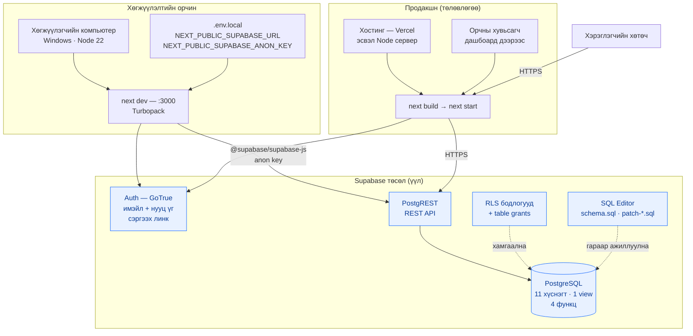
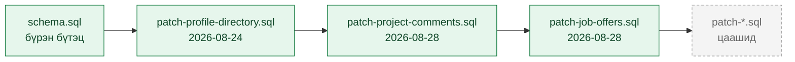

# 2. Deployment / Infrastructure Diagram

Юу хаана ажилладаг, ямар тохиргоо шаардлагатай вэ.

## Миграцийн дараалал

`supabase/` доторх файлууд. Шинэ өгөгдлийн сан бол `schema.sql`-ыг дээрээс доош нэг удаа
ажиллуулна. Аль хэдийн байгаа санд бол patch файлуудыг дарааллаар нь ажиллуулна.

> Бүх patch файл **idempotent** — дахин ажиллуулахад аюулгүй.
> Хүснэгт нэмэх бүрд RLS бодлого **ба** `grant` хоёуланг нь бичих ёстой: grant дутуу бол
> `permission denied for table` алдаа гарна.

## Хараахан байхгүй дэд бүтэц

| Юу | Одоо | Хэрэгтэй болбол |
|---|---|---|
| Файл хадгалалт | Байхгүй — бүх зураг гадаад URL | Supabase Storage bucket + RLS |
| Имэйл мэдэгдэл | Байхгүй | Supabase Edge Function эсвэл гуравдагч үйлчилгээ |
| Реал-тайм | Байхгүй — бүх өгөгдөл татаж авдаг | Supabase Realtime (зурвас, сэтгэгдэлд) |
| CDN зураг | Unsplash шууд | next/image + loader |
| CI/CD | Байхгүй | `npm run lint` (tsc) + `next build` |
