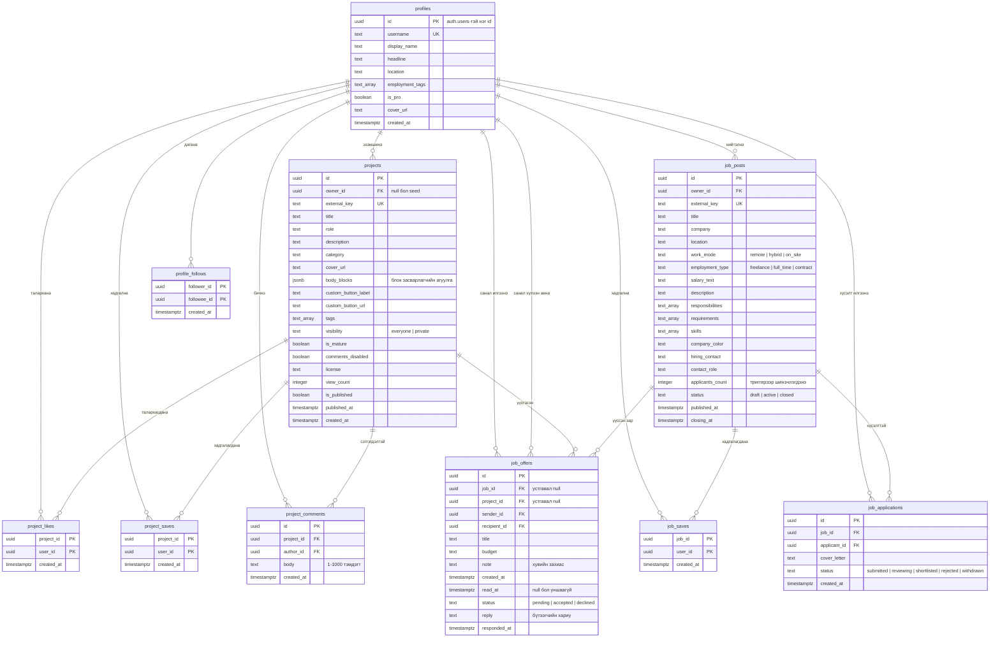
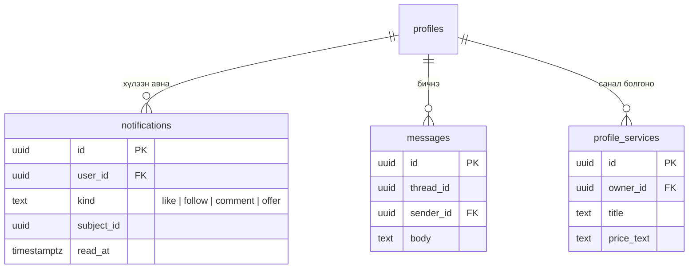

# 3. Entity Relationship Diagram (ERD)

`supabase/schema.sql`-ийн бодит бүтэц. Бүх хүснэгт дээр RLS идэвхтэй.

## Нэмэлт объектууд

| Объект | Төрөл | Зориулалт |
|---|---|---|
| `profile_directory` | View (`security_invoker`) | Хүмүүс хуудсанд зориулж талархал/үзэлт/дагагч/thumbnail-ыг нэгтгэсэн |
| `increment_project_views(uuid)` | Function | Төслийн үзэлт нэмэх, нийтлэгдсэн эсвэл өөрийн төсөл дээр л ажиллана |
| `handle_new_user()` | Trigger | Шинэ хэрэглэгч бүртгэгдэхэд `profiles` мөр автоматаар үүсгэнэ |
| `set_updated_at()` | Trigger | `updated_at` талбарыг автоматаар шинэчилнэ |
| `sync_job_applicant_count()` | Trigger | `job_posts.applicants_count`-ыг хүсэлтийн тоотой синк хийнэ |

## RLS хураангуй

| Хүснэгт | Унших | Бичих | Устгах |
|---|---|---|---|
| `profiles` | бүгд | зөвхөн өөрийнх | — |
| `projects` | нийтлэгдсэн эсвэл өөрийнх | зөвхөн өөрийнх | зөвхөн өөрийнх |
| `project_likes` | бүгд | зөвхөн өөрийнх | зөвхөн өөрийнх |
| `project_saves` | **зөвхөн эзэн** | зөвхөн өөрийнх | зөвхөн өөрийнх |
| `project_comments` | бүгд | өөрийнх, зөвхөн нээлттэй төсөлд (`comments_disabled` RLS-ээр хаана) | зохиогч **эсвэл төслийн эзэн** |
| `profile_follows` | бүгд | зөвхөн өөрийнх | зөвхөн өөрийнх |
| `job_posts` | бүгд | зөвхөн өөрийнх | зөвхөн өөрийнх |
| `job_saves` / `job_applications` | зөвхөн өөрийнх (+ зарын эзэн) | зөвхөн өөрийнх | зөвхөн өөрийнх |
| `job_offers` | **зөвхөн илгээгч ба хүлээн авагч** | илгээгч (insert) · хүлээн авагч (хариу) | хоёулаа |

> `job_offers` бол цорын ганц **бүрэн хаалттай** хүснэгт: төсөв, хувийн захиас агуулдаг тул
> `anon` эрх огт өгөөгүй.

## Цаашид нэмэгдэж болох

