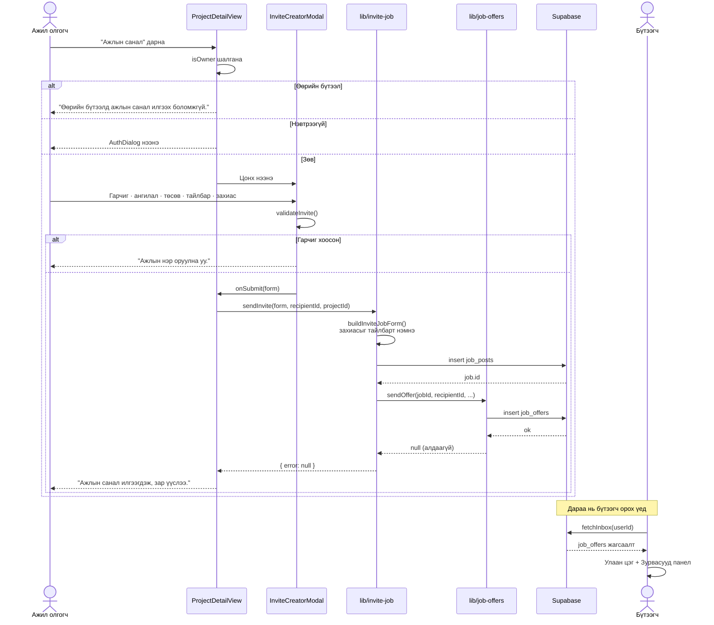
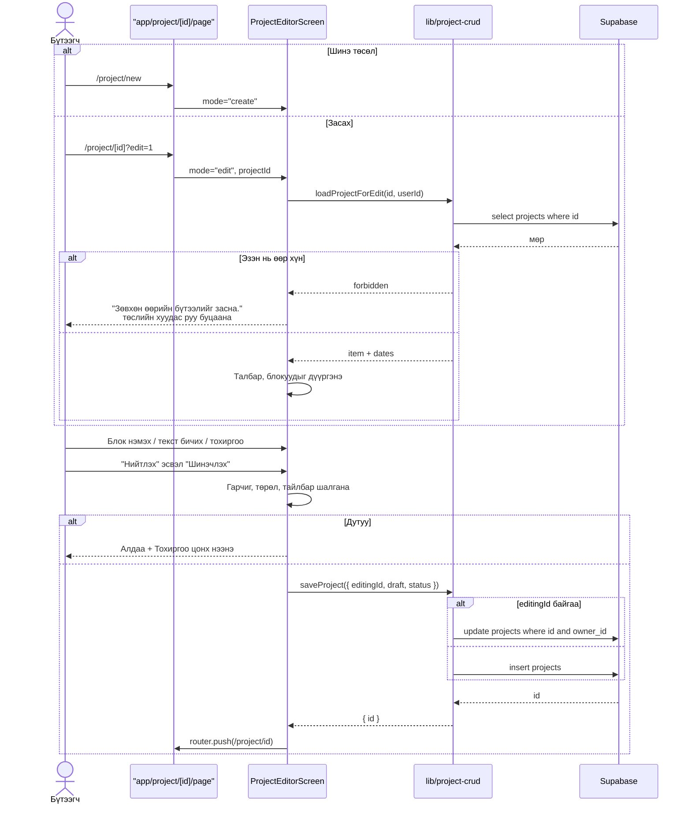
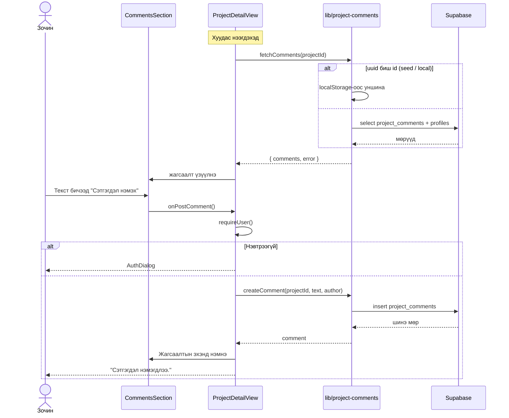
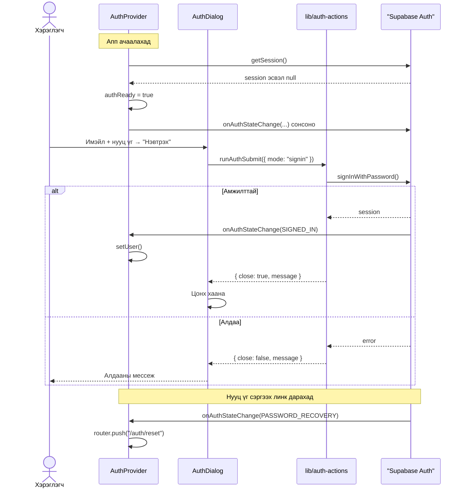
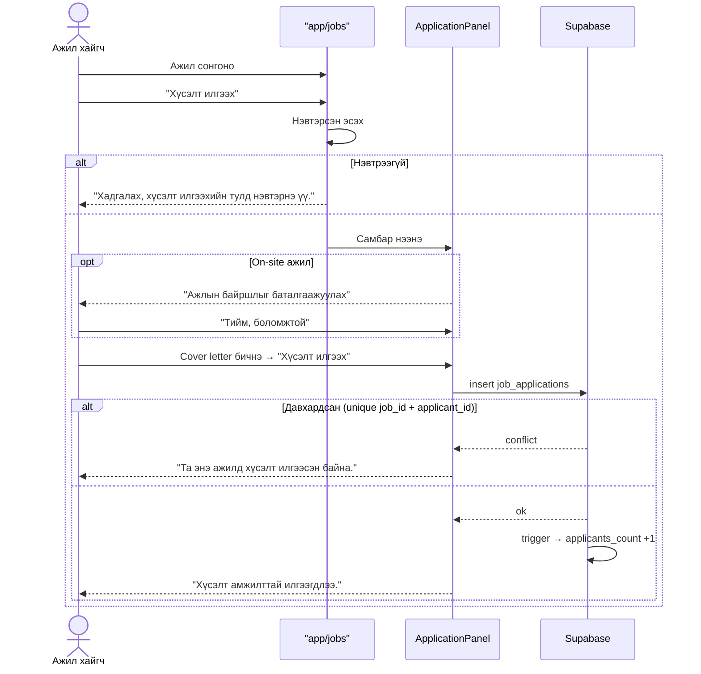

# 4. Sequence Diagrams

Системийн гол таван үйл явцын дараалал.

---

## 4.1 Ажлын санал илгээх (хамгийн нийлмэл урсгал)

---

## 4.2 Төсөл нийтлэх (create) ба засах (update)

---

## 4.3 Сэтгэгдэл бичих

---

## 4.4 Нэвтрэх ба сесс сэргээх

---

## 4.5 Ажилд хүсэлт илгээх

