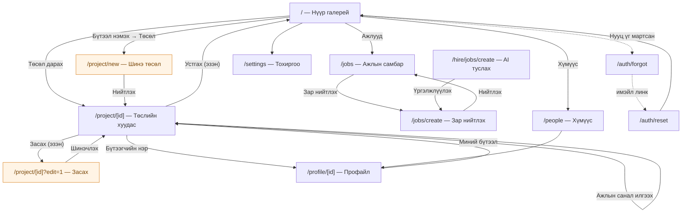
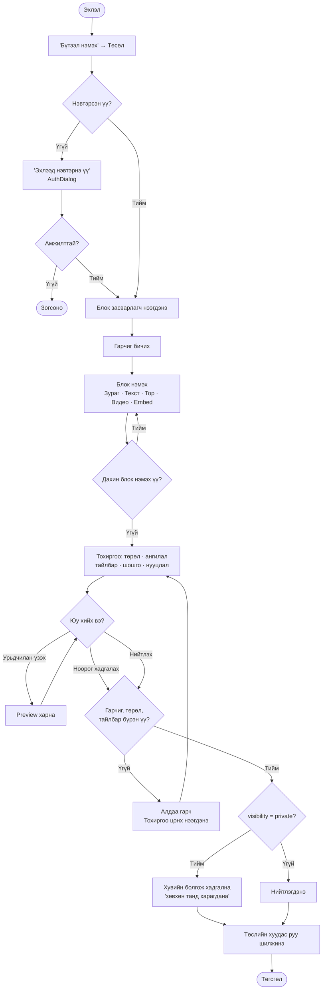
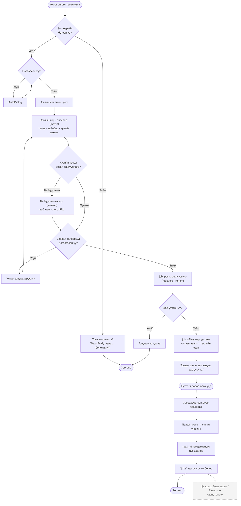
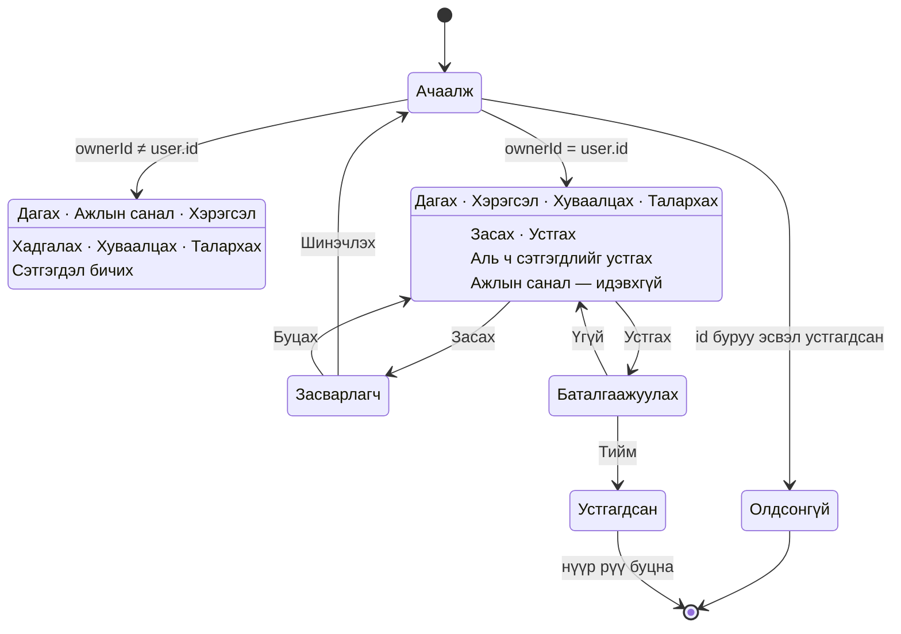

# 5. Activity Diagram / User Flow

---

## 5.1 Сайтын бүх маршрут (navigation map)

---

## 5.2 Бүтээл нийтлэх урсгал (activity)

---

## 5.3 Ажлын саналын бүрэн мөчлөг

---

## 5.4 Төсөл үзэх (эзэн ба зочны ялгаа)

