# 6. Use Case Diagram

Оролцогчид ба тэдний хийж чадах үйлдлүүд. Mermaid-д use-case тэмдэглэгээ байхгүй тул
flowchart-аар дүрсэлсэн: зүүн талд оролцогч, баруун талд use case.

```mermaid
flowchart LR
  Guest(["Зочин<br/>нэвтрээгүй"])
  User(["Хэрэглэгч<br/>нэвтэрсэн"])
  Creator(["Бүтээгч<br/>төслийн эзэн"])
  Employer(["Ажил олгогч"])
  System(["Систем<br/>Supabase"])

  subgraph UC1["Судлах"]
    A1(["Галерей үзэх"])
    A2(["Төслийн дэлгэрэнгүй үзэх"])
    A3(["Хайх, шүүх, эрэмбэлэх"])
    A4(["Ажлын зар үзэх"])
    A5(["Бүтээгчид үзэх"])
    A6(["Профайл үзэх"])
  end

  subgraph UC2["Бүртгэл"]
    B1(["Бүртгүүлэх"])
    B2(["Нэвтрэх"])
    B3(["Нууц үг сэргээх"])
    B4(["Гарах"])
    B5(["Профайл засах"])
  end

  subgraph UC3["Бүтээл"]
    C1(["Төсөл үүсгэх"])
    C2(["Төсөл засах"])
    C3(["Төсөл устгах"])
    C4(["Ноорогт хадгалах"])
    C5(["Нууцлал тохируулах"])
  end

  subgraph UC4["Харилцан үйлдэл"]
    D1(["Талархал илгээх"])
    D2(["Төсөл хадгалах"])
    D3(["Бүтээгч дагах"])
    D4(["Сэтгэгдэл бичих"])
    D5(["Сэтгэгдэл устгах"])
    D6(["Холбоос хуваалцах"])
  end

  subgraph UC5["Ажил"]
    E1(["Ажлын зар нийтлэх"])
    E2(["Ажилд хүсэлт илгээх"])
    E3(["Ажил хадгалах"])
    E4(["Ажлын санал илгээх"])
    E5(["Ажлын санал хүлээн авах"])
  end

  Guest --> A1 & A2 & A3 & A4 & A5 & A6
  Guest --> B1 & B2 & B3

  User --> B4 & B5
  User --> D1 & D2 & D3 & D4 & D6
  User --> C1 & C4
  User --> E2 & E3

  Creator --> C2 & C3 & C5
  Creator --> D5
  Creator --> E5

  Employer --> E1 & E4

  System --> F1(["profiles мөр автоматаар үүсгэх"])
  System --> F2(["Үзэлт нэмэх"])
  System --> F3(["Хүсэлтийн тоо тоолох"])
  System --> F4(["RLS-ээр эрх шалгах"])

  classDef guest fill:#f4f4f4,stroke:#888
  classDef owner fill:#fff4e5,stroke:#d98324
  classDef emp fill:#e8f1ff,stroke:#1769ff
  class Guest guest
  class Creator owner
  class Employer emp
```

## Эрхийн матриц

| Use case | Зочин | Хэрэглэгч | Эзэн | Тайлбар |
|---|:--:|:--:|:--:|---|
| Галерей / төсөл үзэх | ✅ | ✅ | ✅ | Зөвхөн `is_published` |
| Хайх, шүүх | ✅ | ✅ | ✅ | |
| Талархал, хадгалах, дагах | ❌ | ✅ | ✅ | Дарахад нэвтрэх цонх гарна |
| Сэтгэгдэл бичих | ❌ | ✅ | ✅ | `comments_disabled` бол хаалттай |
| Сэтгэгдэл устгах | ❌ | өөрийнх | **бүгдийг** | Эзэн модератор эрхтэй |
| Төсөл үүсгэх | ❌ | ✅ | ✅ | |
| Төсөл засах / устгах | ❌ | ❌ | ✅ | RLS-ээр давхар хамгаалагдсан |
| Ноорог / хувийн төсөл | ❌ | ✅ | ✅ | Зөвхөн эзэнд харагдана |
| Ажлын зар нийтлэх | ❌ | ✅ | ✅ | |
| Ажилд хүсэлт илгээх | ❌ | ✅ | ✅ | Нэг ажилд нэг удаа |
| Ажлын санал илгээх | ❌ | ✅ | **❌ өөртөө** | `sender_id <> recipient_id` |
| Ажлын санал унших | ❌ | ❌ | зөвхөн хүлээн авагч | Илгээгч ч бас өөрийнхөө саналыг харна |

## Demo горимын онцлог

Backend тохируулаагүй үед **бүх use case нэвтрэлтгүйгээр** ажиллана — өгөгдөл localStorage
дээр хадгалагдаж, зөвхөн тухайн хөтөч дээр л үлдэнэ. Энэ нь танилцуулга, дизайн шалгахад
зориулагдсан.
