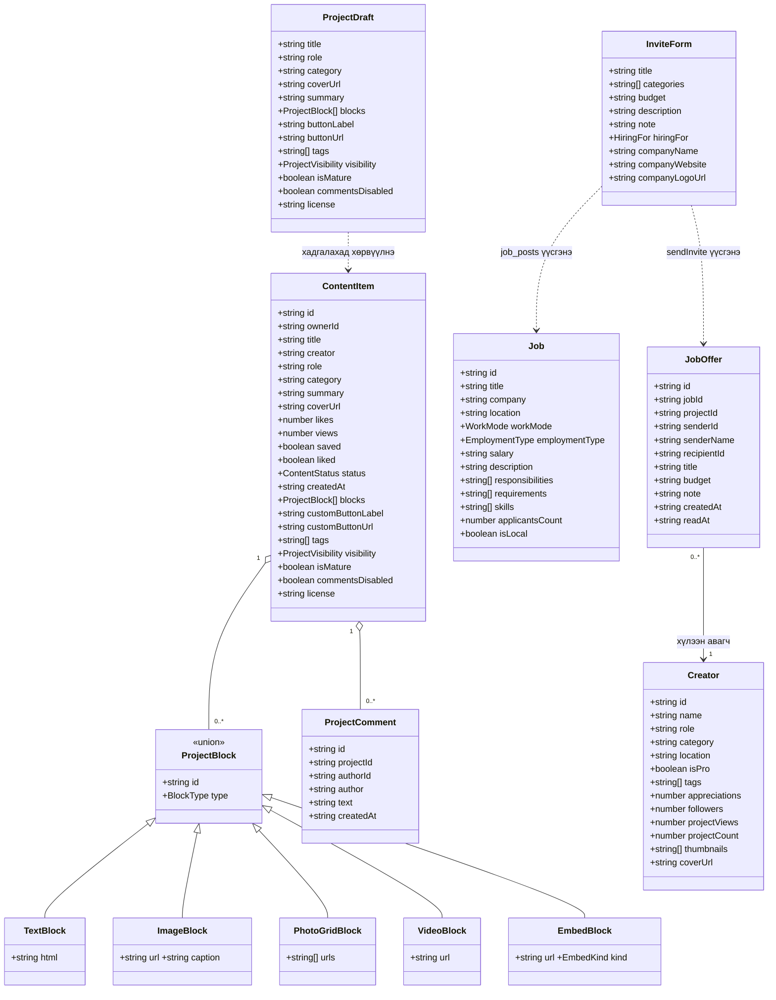
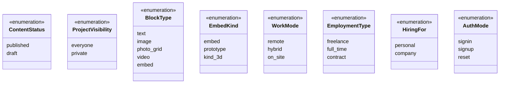
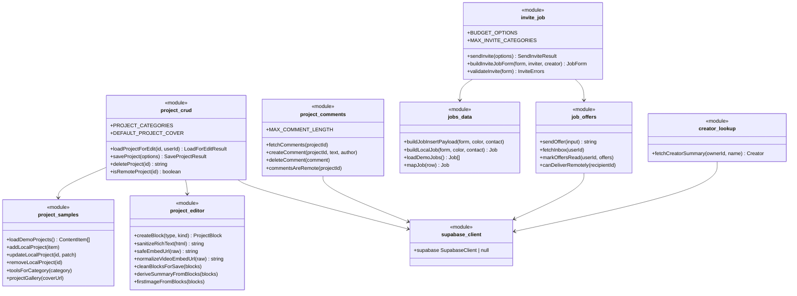
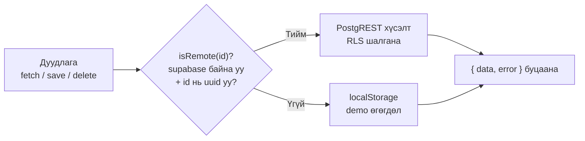

# 7. Class Diagram

TypeScript домэйн загварууд (`lib/`). Классын оронд `type` ашигладаг тул талбаруудыг класс
хэлбэрээр, функцуудыг модуль хэлбэрээр дүрсэлсэн.

## 7.1 Домэйн төрлүүд

## 7.2 Тоочсон төрлүүд (enums)

> **Тэмдэглэл:** `EmbedKind.kind_3d` нь кодод `"3d"` гэсэн утгатай — mermaid-ийн
> classDiagram цифрээр эхэлсэн гишүүний нэрийг зөвшөөрдөггүй тул ингэж бичсэн.

## 7.3 lib модулиуд ба тэдгээрийн функцууд

## 7.4 Ерөнхий хэв маяг

Бүх өгөгдлийн модуль ижил гурван зарчмыг баримтална:

