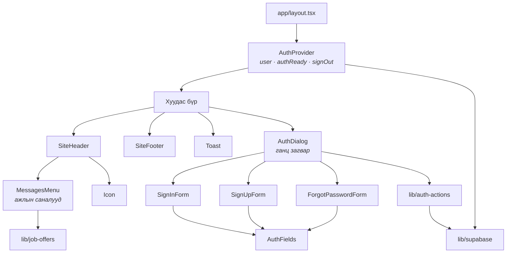
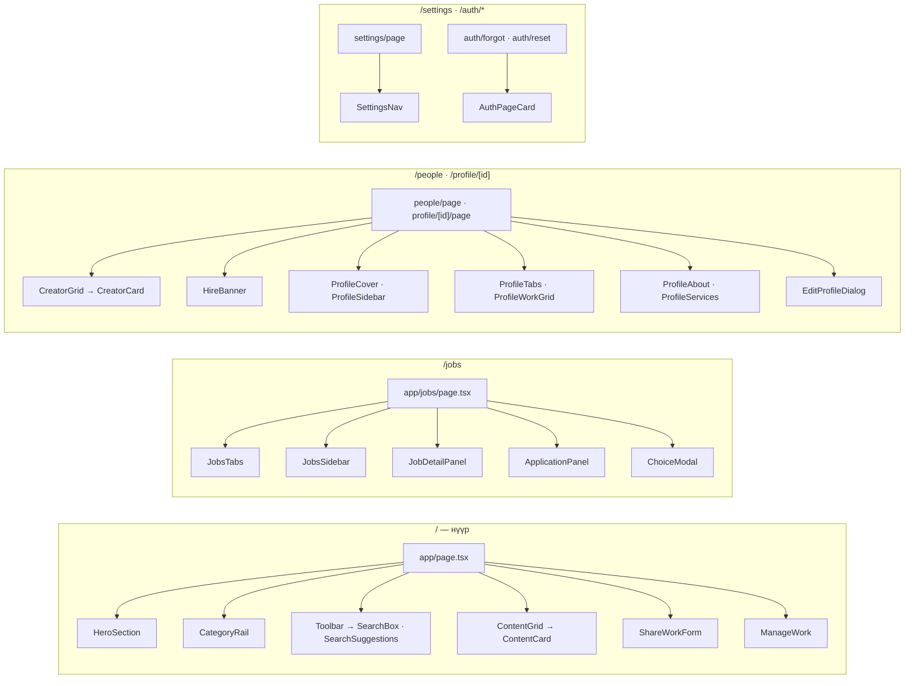
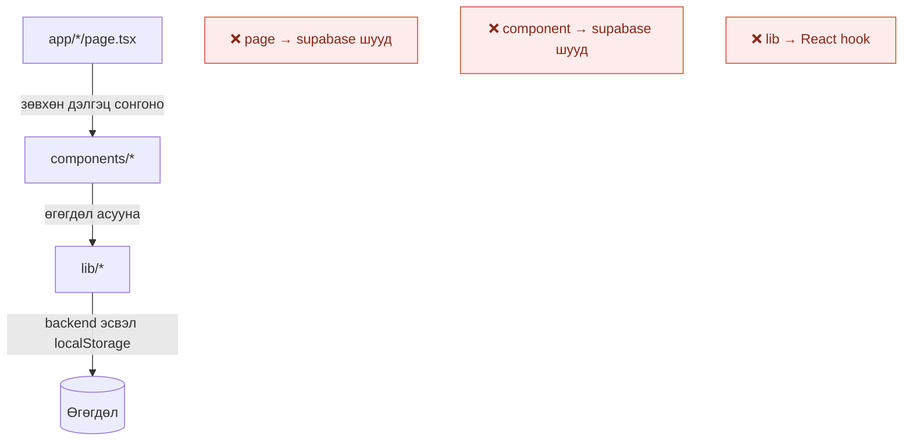

# 8. Component Diagram

React компонентын мод ба тэдгээрийн `lib/` хамаарал.

## 8.1 Төслийн маршрут (`/project/[id]`) — хамгийн нийлмэл хэсэг

```mermaid
flowchart TB
  P["app/project/[id]/page.tsx<br/><i>зөвхөн дэлгэц сонгоно</i>"]
  P -->|"id = new"| ED
  P -->|"?edit=1"| ED
  P -->|"бусад"| DV
  P -->|"Suspense fallback"| SK["CaseStudySkeleton"]

  subgraph View["Үзэх дэлгэц"]
    DV["ProjectDetailView"]
    DV --> AR["ActionRail"]
    DV --> BR["BlockRenderer"]
    DV --> SB["StoryBody"]
    DV --> AF["AppreciateFooter"]
    DV --> CS["CommentsSection"]
    DV --> MT["MetaTagsGrid"]
    DV --> IM["InviteCreatorModal"]
    DV --> AD["AuthDialog"]
    AR --> CHC["CreatorHoverCard"]
    AR --> THC["ToolsHoverCard"]
  end

  subgraph Editor["Засварлагч дэлгэц"]
    ED["ProjectEditorScreen"]
    ED --> ETB["EditorTopBar"]
    ED --> ESB["EditorSidebar"]
    ED --> BP["BlockPicker"]
    ED --> BEC["BlockEditorCanvas"]
    ED --> SM["SettingsModal"]
    ED --> PV["ProjectPreview"]
    BEC --> TBE["TextBlockEditor"]
    BEC --> IBE["ImageBlockEditor"]
    BEC --> PGE["PhotoGridBlockEditor"]
    BEC --> VBE["VideoBlockEditor"]
    BEC --> EBE["EmbedBlockEditor"]
  end

  subgraph Libs["lib/"]
    L1["project-crud"]
    L2["project-comments"]
    L3["invite-job → job-offers"]
    L4["creator-lookup"]
    L5["creative-tools"]
    L6["project-editor"]
    L7["use-hover-card"]
  end

  DV --> L1
  DV --> L2
  DV --> L3
  ED --> L1
  ED --> L6
  CHC --> L4
  CHC --> L7
  THC --> L5
  THC --> L7
  BEC --> L6

  classDef route fill:#e8f1ff,stroke:#1769ff,color:#0b3c94
  classDef lib fill:#fff4e5,stroke:#d98324,color:#7a4708
  class P route
  class L1,L2,L3,L4,L5,L6,L7 lib
```

## 8.2 Хуваалцсан бүрхүүл (бүх хуудсанд)

## 8.3 Бусад маршрутууд

## 8.4 Загварын файлууд

| CSS файл | Хамрах хүрээ |
|---|---|
| `base-theme.css` | Глобал reset, өнгө, товч, оролтын талбар, footer, modal shell |
| `header-menus.css` | Толгой, унтраах цэс, "Бүтээл нэмэх" цэс, зурвасын панел |
| `explore-feed.css` | Нүүр галерей, карт, ангиллын мөр |
| `project-detail.css` | Төслийн хуудас, action rail, hover карт, сэтгэгдэл |
| `project-editor.css` | Блок засварлагч, тохиргооны цонх, preview |
| `jobs.css` | Ажлын самбар, бүх modal shell, ажлын саналын цонх |
| `jobs-hire-flow.css` | Зар нийтлэх маягт, AI туслах |
| `people.css` / `profile.css` | Бүтээгчийн карт, профайл |
| `settings.css` | Тохиргооны хуудас |

## 8.5 Хамаарлын дүрмүүд

> Ганц үл хамаарах зүйл: `lib/use-hover-card.ts` бол зориудаар hook — олон компонент
> ижил hover зан төлөвийг хуваалцахын тулд.
